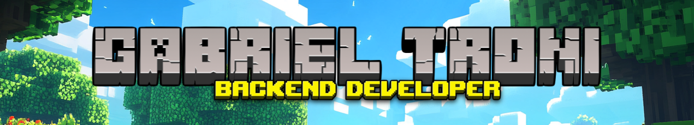

  

 
    
   
   
   

  <h3>🌐 Idioma | Language</h3>
  

    <a href="#português">Português</a> |
    <a href="#english">English</a>
  

---

## Português

### 👨‍💻 Sobre Mim

💼 **Experiência Profissional** 
  - 3+ anos de experiência como desenvolvedor
  - Atualmente trabalhando como Desenvolvedor Full Stack Júnior (React + Express) na **[Gamma Distribuidora](https://br.linkedin.com/company/gammadistribuidora)**

🎓 **Formação** 
  - Graduado em Análise e Desenvolvimento de Sistemas na UFPR (Universidade Federal do Paraná)
  - Cursando Pós-graduação em Desenvolvimento Full Stack na PUCPR (Pontifícia Universidade Católica do Paraná)

🧠 **Atualmente Aprendendo** 
  - Boas práticas de segurança e performance no desenvolvimento web full stack

💡 **Saiba Mais:** [Perfil no LinkedIn](https://www.linkedin.com/in/gabriel-troni/)

### ⭐ Certificações

  

  

  

### 🛠️ Principais Habilidades

  
  
  
  
  
  

  
  
  
  
  
  
  

 

  <i>⭐ Fique à vontade para explorar meus repositórios e não hesite em entrar em contato!</i>

---

## English

### 👨‍💻 About Me

💼 **Professional Experience** 
  - 3+ years of experience as a developer
  - Currently working as Junior Full Stack Developer (React + Express) at **[Gamma Distribuidora](https://br.linkedin.com/company/gammadistribuidora)**

🎓 **Education** 
  - Graduated in Systems Analysis and Development at UFPR (Federal University of Paraná)
  - Pursuing Postgraduate degree in Full Stack Development at PUCPR (Pontifical Catholic University of Paraná)

🧠 **Currently Learning** 
  - Best practices in security and performance for full stack web development

💡 **Learn More:** [LinkedIn Profile](https://www.linkedin.com/in/gabriel-troni/?locale=en_US)

### ⭐ Certifications

  

  

  

### 🛠️ Main Skills

  
  
  
  
  
  

  
  
  
  
  
  
  

 

  <i>⭐ Feel free to explore my repositories and don't hesitate to reach out!</i>

